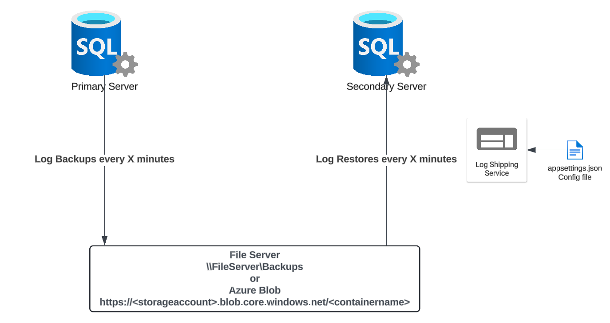

# SQL Log Shipping Service 

This project provides a solution for automatically restoring SQL Server transaction log backups. Implemented as a .NET application that runs as a Windows service, it provides the following features:

* **Simple config based setup.** *Eliminates the need for per-database basis configuration.  Very effective for handling a large number of databases*
* **Automatic initialization of new databases**. *Incorporate new databases without any manual intervention*
* **UNC path or URL (Azure Blob or S3).** *Additional flexibility to work directly with Azure blob containers, S3 buckets or standard UNC paths.  e.g. `\\server\share`*
* **Scalable.** *The log shipping service allows for a configurable number of threads so your SQL instance isn't overloaded with a job per database or constrained by a single job.  The service is efficient and can scale to a large number (thousands) of databases*
* **Standby mode support.** *Allow users to query your log shipped databases.  Prevent open connections from blocking log restores with options to kill sessions after a period of time. Keep your databases available for querying during certain hours.  Standby option is only applied after the last log is restored (more efficient than built-in log shipping)*
* **A disaster recovery tool**.  *Beyond the tools primary capability as a log shipping tool, it can also be used as part of your disaster recovery strategy to restore your databases from backup.*

## Intended Audience

Ideal for anyone looking to implement log shipping or needing a reliable process for database recovery from backups. Especially beneficial for environments with a large number of databases or utilizing BACKUP TO URL, where alternative solutions are limited. Suitable for both small and large-scale database environments.

## Getting Started

The [Quick Start](../../wiki/Quick-Start) guide will help you get up and running quickly.  The [wiki](../../wiki) also provides documentation on all the features and functionality of the tool.

👉 [Get Started Here](../../wiki/Quick-Start)

## Architecture

The tool runs as a Windows service, configured using an *appsettings.json* config file.  Log restores are run on a specified [schedule](../../wiki/Schedule) with a configurable number of threads processing the restores.  It can restore logs from a file share or from Azure blob.  For each database in a restoring or standby state, it enumerates the files for the database, checks the restore headers and restores the appropriate log files.

New databases can be [initialized](../../wiki/Initialization) by specifying the Full/Diff backup paths OR by specifying a connection string to the primary server.

Designed solely for restoration, this service complements backup solutions like [Ola'Hallegren's](https://ola.hallengren.com/) maintenance solution, which offer parallel backup capabilities and [support for BACKUP TO URL](https://gist.github.com/scheffler/7edd40f430235aab651fadcc7d191a89).

